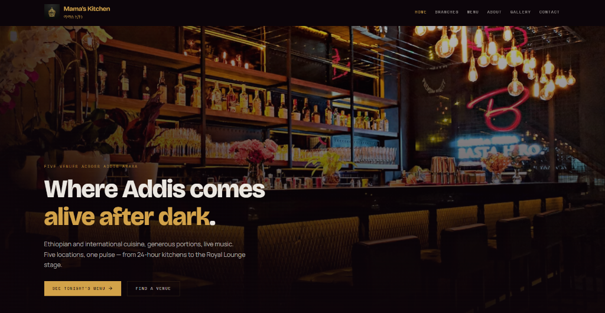
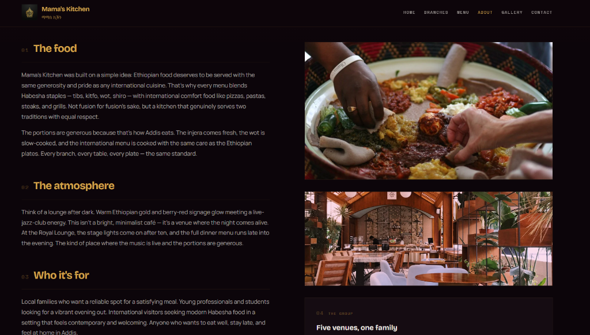
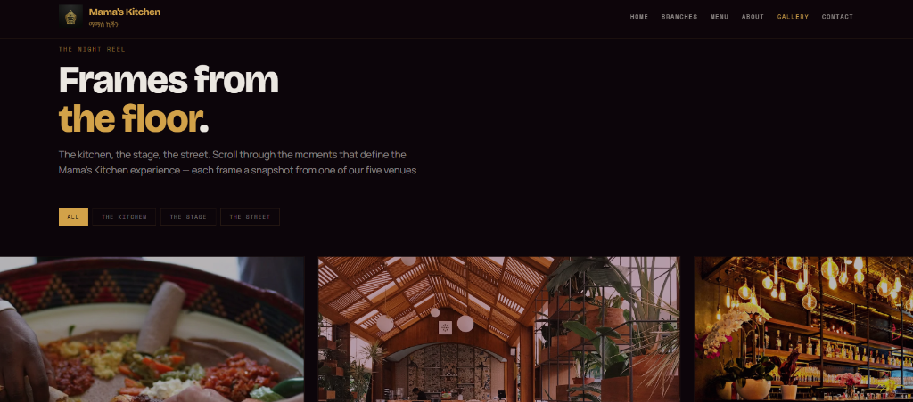

# Mama's Kitchen

> **"Where Addis comes alive after dark."**
> A premium, atmospheric web portal for the Mama's Kitchen group in Addis Ababa, designed with the moody, cinematic **Addis Nocturne** aesthetic.

---

## 📸 Screenshots

### Home Screen


### About Section


### Gallery — The Night Reel


---

## 🎨 Visual Identity & Theme

Inspired by the glowing warmth of stage lights and brass instruments in Addis Ababa's nightlife districts:
*   **Palette**: Deep velvet-aubergine (`#1a1014`), glowing Ethiopian gold (`#d4a24e`), wine-berry red (`#8c2f39`), and spotlight cream (`#f3e9dd`).
*   **Typography**: *Bricolage Grotesque* for bold, structural headers paired with *Space Mono* for utility labels, numbers, and pricing ranges.
*   **Aesthetic**: Asymmetric editorial layout with thin-line dividers, staggered viewport fades, and a Polaroid film-reel gallery.

---

## ✨ Features

1.  **Tonight's Lineup (Menu)**: Structured like a concert program or tracklist. Includes Ethiopian staples (Tibs, Kitfo, Wot), Western comfort dishes, and lounge cocktails.
2.  **Venues & Event Stage**: Features all five locations (Bole Medhanialem, Megenagna, Entoto, Royal Lounge, and Mama's Inn) with verified details, contact cards, map embeds, and upcoming event stages.
3.  **The Night Reel (Gallery)**: A desktop snap-scroll horizontal gallery of Polaroid frames with vignette hover reveals and local image fallback handling.
4.  **LocalBusiness & Organization SEO**: Fully injected structured JSON-LD schemas on all routing views for optimal search rankings.

---

## 🛠️ Tech Stack

*   **Frontend Framework**: React 19 + TypeScript
*   **Build Tooling**: Vite 7
*   **Styling**: Tailwind CSS v4 + Vanilla OKLCH custom tokens
*   **Routing**: `wouter` (compact client-side router)
*   **Components & Icons**: Radix UI + Lucide React

---

## 🚀 Running Locally

Follow these steps to set up and run the project:

### 1. Restore Dependencies
Make sure you are in the project root directory and run:
```bash
pnpm install
```

### 2. Approve Build Scripts
Due to pnpm security policies for compiling binaries (like `esbuild` and `@tailwindcss/oxide`), approve the local compiler builds:
```bash
pnpm approve-builds
```

### 3. Spin Up Development Server
Start Vite:
```bash
pnpm dev
```
Open **`http://localhost:3000`** (or the port specified in your console) to view the application.
